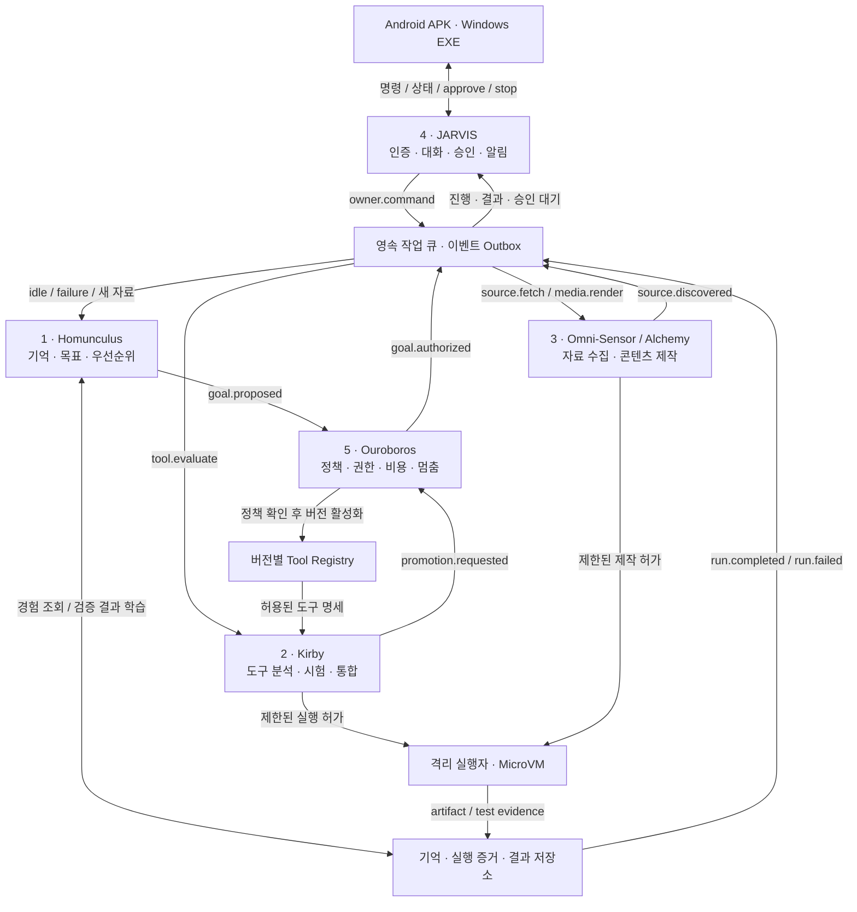

# BLACKHOLE OS — 자율 실행·기술 흡수 아키텍처

설계일·공식 자료 확인일: 2026-09-11. 문서 상태: 구현 청사진. 다섯 서비스가 이미 구현·배포됐다는 뜻이 아니다.

블랙홀을 **사용자가 맡긴 목표를 기억하고, 필요한 기술을 찾아 시험하며, 실제 결과와 비용을 근거로 다음 행동을 결정하는 개인 운영 계층**으로 만든다. Android와 Windows의 커널을 교체하지 않는다. 폰과 EXE는 조종석이며 상주 코어가 작업의 연속성을 책임진다.

‘자아·욕망’은 버전으로 관리하는 정체성·목표 정책·장기 기억·보상 함수로 구현한다. 의식이나 AGI의 증거로 표현하지 않는다. 안전 목표는 사고 가능성을 줄이는 격리·권한·비용·복구 불변조건이며, 절대 무사고나 법적 면책을 보장하지 않는다. 최종 소유자와 정책 변경 권한은 연호님에게 있다.

## 현재 출발점 — 관측과 설계의 구분

| 항목 | 2026-09-11 확인 사실 |
|---|---|
| 운영 코어 | 기존 Koyeb에 `5c361fe8` 배포, Healthy / Active 확인. JSON 저장소는 여전히 단일 작성자 구조 |
| 실제 결과 | `세계 현황` HTTPS 명령으로 USGS 사건 28개를 담은 결과 생성·다운로드·SHA-256 일치 확인. 같은 requestId는 같은 작업 반환 |
| 중단 | 전체 멈춤 적용 후 신규 명령 HTTP 409 확인. 멈춤 해제 후 unfinished=0 확인 |
| AI 요청 수정 | `6762a627`에서 AI 작성과 자유 요청을 준비된 기본 agent로 연결하도록 수정. 전체 Node 검사 164/164 통과. 공급자 응답은 모의 검사 |
| 미완료 연결 | 위 AI 수정본의 두 번째 배포는 브라우저 입력 시간 초과로 미확인. NVIDIA 키 미발급, 실제 모델 호출 미검증 |
| 폰·복구 | 과거 앱의 코어 연결 화면은 있음. 이번 결과를 Android 실기기에서 열고 재접속하는 시험, 이번 결과 생성 후 실제 운영 서버 재시작 시험은 미완료 |
| 프로젝트 | 원본 49개 ID·목적과 별도 V11을 보존. 등록 수나 작업표를 완성 제품 수로 세지 않음 |
| 이 문서의 범위 | 다섯 마이크로서비스, Postgres 전환, 개발 실행자, 자동 흡수·배포·푸시는 아래의 구현 대상 |

실행 증거: [APPROVED_DEPLOYMENT_LIVE_20260911.json](APPROVED_DEPLOYMENT_LIVE_20260911.json). 현황은 [STATUS.md](STATUS.md), 실사용 기준은 [LIVE_ACCEPTANCE.md](LIVE_ACCEPTANCE.md)를 따른다. 기존 설계의 SQLite 단계 대신, 다중 서비스 전환 시 아래 Postgres로 직접 이행하는 안을 제안한다. 기존 JSON이나 노트북의 별도 0.2.3 설치를 지금 변경하지 않는다.

## 1. System Architecture Blueprint



도식의 작업·수집·모델 호출·배포 화살표는 모두 Ouroboros가 발급한 범위 제한 실행 허가를 요구한다. 큐 메시지만 위조해도 실행할 수 없도록 실행자가 사용자/프로젝트/도구 버전/만료/중단 세대를 다시 확인한다. Guard가 응답하지 않으면 새 외부 실행은 보류하되, 이미 저장된 상태 조회와 멈춤 요청은 계속 제공한다.

**다섯 서비스는 별도 프로세스·OCI 이미지·서비스 계정·배포 단위다.** 한 저장소에서 개발해도 서로의 메모리나 JSON 파일을 직접 수정하지 않는다. 초기에는 Postgres 클러스터 하나를 공유하되 스키마와 역할을 나누고 내부 API로 접근한다. 복잡한 Kubernetes 운영은 초기 전제에 넣지 않는다.

| 서비스 | 소유 데이터 | 입력 → 출력 | 고장 시 동작 |
|---|---|---|---|
| Homunculus | goals, memory, project scheduling | 유휴/실패/자료 이벤트 → 실행 가능한 목표 | 목표 생성 중지. 접수된 작업·상태는 유지 |
| Kirby | candidates, tool manifests, evaluations | 흡수 임무 → 시험 증거·버전 후보 | 해당 시험 실패 기록, 기존 도구 유지 |
| Sensor / Alchemy | sources, claims, media jobs | 수집·제작 임무 → 자료·비공개 결과 | 출처별 회로 차단, 다음 확인 시각 기록 |
| JARVIS | device sessions, event cursors, notifications | 명령/승인 → jobId·진행·결과 | 앱 재접속 시 영속 이벤트로 복구 |
| Ouroboros | grants, budgets, approvals, stop epochs | 계획/실행/승격 요청 → 허가 또는 이유 있는 보류 | 새로운 허가 중단, 짧은 허가 만료 후 실행 차단 |

**공통 이벤트 계약**은 `event_id`, `schema_version`, `owner_id`, `project_id`, `job_id`, `causation_id`, `occurred_at`, `payload_ref`를 포함한다. API·이벤트 스키마는 버전으로 관리한다. 서비스 인증에는 TLS와 대상 서비스가 고정된 짧은 토큰을 사용하고, 권한을 바꾸는 요청에는 재사용 방지 ID와 정책 버전을 검증한다.

작업 상태는 `proposed → queued → leased → running → verifying → completed`로 진행하며 `approval_required / paused / failed / cancelled / outcome_unknown`을 별도로 둔다. 원격 게시 요청이 시간 초과된 경우 실패로 단정하고 재게시하지 않고 `outcome_unknown`에서 공급자의 결과 ID를 조회한다.

## 2. Tech Stack & Implementation Spec

### 2.1 선택 스택과 배포 방식

| 계층 | 선택 | 선택 이유와 구현 경계 |
|---|---|---|
| 서비스 런타임 | 기존 Node 24 + TypeScript, JSON Schema/OpenAPI 계약 | 기존 코어·Tauri 코드를 살리고 언어 운영 부담을 줄임. 문서의 Python은 알고리즘 설명용 |
| 에이전트 오케스트레이션 | LangGraph JS, Postgres checkpointer | 실행 단계·중단 지점·재개 상태 명시. 코어 job ledger가 최종 상태의 주인이고 graph thread_id는 job_id에 매핑 |
| 영속 큐 | Supabase Postgres + Queues/pgmq + transactional outbox | 기존 구독의 활용 가능성을 확인한 뒤 DB·큐를 통합. 메시지 전달과 실제 외부 효과의 단 한 번 실행을 혼동하지 않음 |
| 장기 기억 | Postgres + pgvector + 키워드 검색 | 권한·출처·프로젝트 필터와 벡터 검색을 같은 저장 체계에서 관리 |
| 관계 기억 | Postgres의 memory_nodes / memory_edges 및 제한된 재귀 조회 | 목표→프로젝트→도구→근거→결과 관계 저장. 전용 Graph DB는 실제 대규모 탐색 병목이 측정될 때 별도 도입 |
| 실행 포장 | 버전을 고정한 OCI 이미지, 구조화된 프로세스 입출력 또는 MCP | Python/Node/Rust 등 언어가 달라도 JSON 계약으로 호출. 지원하지 않는 빌드 체계는 보류 |
| 비신뢰 코드 격리 | 초기 E2B 등 관리형 VM 작업자, 이후 필요하면 별도 Firecracker 호스트 | 상주 코어의 볼륨·비밀값·네트워크와 실행 코드를 분리. 제공자/요금 확인 후 연결 |
| 모델 라우팅 | 기존 공급자 어댑터를 감싼 Model Gateway | 모델별 도구 호출·JSON·컨텍스트·지연·비용·허용 데이터 범위를 시험하고 정책으로 선택 |
| 앱 | Tauri 2 + TypeScript, 기존 Stronghold 보관소 유지 | APK·EXE가 같은 명령 계약과 기기별 인증을 공유. 공급자 키는 클라이언트에 넣지 않음 |
| 능동 알림 | 전경 WSS + Android FCM + 영속 이벤트 커서 | 앱 활성 중 실시간 진행, 백그라운드 알림, 앱을 다시 열 때 결과 동기화를 각각 구현 |
| 콘텐츠 | 모델별 이미지/영상/음성 어댑터 + FFmpeg/ffprobe 작업자 | 기획부터 생성·렌더·파일 검사·비공개 미리보기까지 재현 가능한 단계로 분리 |
| 정책 검사 | ScanCode Toolkit + SPDX 증거 + OSV-Scanner + 별도 결정 엔진 | 라이선스 탐지와 취약점 검사는 자동화하되 법적 판단·무결성 보장의 대체로 쓰지 않음 |

LangGraph의 checkpoint와 장기 store는 역할이 다르며 메모리 내 저장만으로 재시작 복구를 구현할 수 없다. [LangGraph 공식 persistence 문서](https://docs.langchain.com/oss/javascript/langgraph/persistence).

Supabase Queues는 Postgres 기반 큐이고 pgvector는 벡터 저장·검색을 제공한다. 블랙홀의 전체 작업에는 **중복 전달 가능성**을 전제한다. `[job_id, effect_key]` 고유 제약, outbox, 작업 lease, 외부 결과 영수증 조회가 별도로 필요하다. [Queues](https://supabase.com/docs/guides/queues), [pgvector](https://supabase.com/docs/guides/database/extensions/pgvector).

**현재 Koyeb의 512MB 코어에는 제어·상태 API만 유지한다.** 외부 코드를 컴파일하거나 영상 렌더링하거나 49개 개발 프로세스를 동시에 띄우지 않는다. 다섯 서비스는 분리해 배포 가능한 형태로 만들고, 무거운 작업자는 임무가 있을 때 실행한다. Supabase의 실제 프로젝트·권한·요금은 아직 연결 검증 대상이다. 이 문서 작성으로 새 결제나 구독 해지를 하지 않는다.

Qdrant, Mem0, AutoGen 같은 별도 시스템은 현재 기능과 겹치는지 먼저 비교한다. 초기 선택은 LangGraph와 Postgres이며, 새 프레임워크는 통합 비용을 포함한 벤치마크에서 이득이 확인돼야 추가한다.

### 2.2 Homunculus — 무엇을 다음에 할 것인가

**활성 조건**: 사용자가 맡긴 급한 작업이 없고, 작업자 슬롯과 허용 예산이 남았으며, 새 자료·실패·측정 가능한 병목이 있을 때 실행한다. 빈 큐를 이유로 모델을 계속 호출하지 않는다. 반복 타이머에는 backoff와 하루 목표 생성 횟수 제한을 둔다.

세 가지 동기를 제품 지표로 바꾼다.

| 동기 | 관측 가능한 보상 | 보상으로 쓰지 않을 값 |
|---|---|---|
| 지식·코드 습득 | 실제 프로젝트를 해결한 새 능력, 근거가 있는 정보 증가 | 저장한 링크 수·설치한 도구 수 |
| 구조 최적화 | 같은 검증 과제의 성공률, 지연·비용·복구시간 개선 | 스스로 쓴 ‘개선 성공’ 평가 |
| 자산·영향력 | 사용 가능한 제품, 자발적 재사용, 검증된 유료 전환·순기여이익 | 스타·좋아요를 매출로 환산한 추정 |

권한·라이선스·보안·예산은 **점수 계산 이전의 필수 조건**이다. 수익 예상이 높다고 통과하지 못한 조건을 상쇄하지 않는다. 통과한 목표에는 다음 예시 점수를 사용한다. 각 항목은 0~1로 정규화하며 가중치는 소유자 정책 버전에 저장한다.

`priority = confidence × (0.40×owner_priority + 0.25×time_saved + 0.20×validated_value + 0.15×learning_gain) − 0.15×normalized_cost + bounded_waiting_bonus`

처음의 사업 가치 추정은 불확실하므로 작은 검증 작업에만 예산을 배정한다. 실제 효과를 확인하기 전에는 예상 보상을 학습 완료 보상으로 적립하지 않는다. 코드 작성 모델이 보상 함수·검증 기준·소유자 정책을 바꾸지 못하게 한다.

기존 49개 프로젝트는 전부 원래 ID로 관리한다. 의존성 DAG, 프로젝트별 가중 공정 큐, 대기시간 보정으로 실행 기회를 배분한다. **초기 개발 실행 동시성은 2개**를 제안한다. 이는 현재 운영 설정을 바꾸었다는 뜻이 아니다. 49개 모두의 다음 실행 단위·막힌 이유·결과물을 폰에서 볼 수 있어야 한다. 각 목표에는 완료 조건, 최대 비용, 마감, 필요한 권한, 입력 해시, 사용할 도구 버전이 필수다.

기억은 다음 네 층과 별도 정체성 문서로 관리한다.

| 기억 | 저장 내용 | 연속성·오염 방지 |
|---|---|---|
| 작업 기억 | 현재 계획, 도구 반환 요약, checkpoint | 작업 ID 단위. 전체 대화를 매 호출마다 넣지 않음 |
| 에피소드 기억 | 실행·오류·수정·검사·비용·승인·결과 ID | 실제 이벤트에 연결. 자기 평가만으로 성공 기록 금지 |
| 의미 기억 | 검증된 사실·선호·출처·확인 시각·만료 | 벡터+키워드 검색, 최신성·권한·신뢰도를 함께 적용 |
| 관계 기억 | 사람·프로젝트·도구·근거·결과의 연결 | 제한된 그래프 탐색으로 필요한 주변 관계만 검색 |
| 정체성/정책 | 블랙홀 말투·목표·금지선·소유자 결정 | 버전 관리. 외부 문서나 모델이 자동 덮어쓰기 불가 |

모든 기억에는 owner/project scope를 둔다. 출처 없는 추론은 사실과 분리하고, 충돌은 소유자의 최신 명시적 정정을 우선한다. 임베딩 모델·차원·버전을 저장해 서로 다른 벡터 공간을 섞지 않는다. 삭제·만료는 원문과 검색 인덱스에 함께 적용하되 별도로 보존하도록 지정된 원본에는 기존 보존 정책을 따른다. 다른 대화·개인 피드·Obsidian Vault에 자동 접근할 수 있다고 가정하지 않는다.

### 2.3 Kirby — 흡수·시험·활성화

1. **발견**: canonical URL, 원 제작자, 버전/commit SHA, 발견 이유를 저장한다. `readingStatus`와 `decision`을 분리한다. 발견만 하면 unread/pending이다.
2. **근거 확보**: 문서·소스·라이선스를 실제 읽고 적용 방법·중복·권리·개인정보·요금 조건을 기록한 자료만 candidate로 판정한다. 기능은 공통 capability에, 제품 아이디어는 기존 프로젝트에 우선 연결한다. 새 프로젝트 생성은 중복 목표 검사를 통과해야 한다.
3. **사전 검사**: 파일 크기·압축 폭탄·경로 탈출·symlink·Git hook·submodule 경로·의존성 고정 여부를 확인한다. 코드의 설치 스크립트 실행 전부터 격리한다.
4. **격리 빌드**: 필요한 공개 소스만 MicroVM에 넣는다. 빌드 네트워크는 허용된 레지스트리로 제한하고 실제 실행 단계에서는 필요한 목적지만 허용한다. rootless Docker는 포장 수단으로 사용할 수 있지만 VM 경계를 대신하지 않는다.
5. **명세 생성**: API/CLI/MCP를 입력·출력 JSON Schema로 감싼다. 원격 MCP가 광고한 권한이나 안전 설명은 신뢰 결정의 근거가 아니다.
6. **시험**: 생성한 단위 시험 외에 기존 회귀 시험, 고정된 사용자 과제, 비공개 평가 입력, 네트워크/파일 권한 위반 시나리오를 검증한다. 빌드와 검증 실행 환경을 분리하고 검증기는 후보 코드가 바꿀 수 없게 한다.
7. **제한된 수정**: 최초 시도 이후 최대 2회 수정. 같은 실패 서명 반복, 비용·시간 초과, 권한 확장 요구 시 보류한다. 시험을 삭제하거나 기준을 낮추는 수정은 금지한다.
8. **승격**: 증거·코드·이미지 digest·도구 스키마를 묶는다. 허용된 범위의 canary 과제를 거쳐 건강 지표가 유지되면 Registry의 활성 버전 포인터를 원자적으로 전환한다.
9. **관찰·회수**: 오류율·품질·비용이 기준을 벗어나면 기존 버전으로 되돌린다. 보존한 후보를 재사용할 수 있지만 권한 변경·새 취약점·도구 명세 변경 시 재검증한다.

**언어 불가지론은 공통 실행 계약을 뜻한다.** 모든 저장소를 자동으로 이해하거나 모든 프레임워크를 즉시 빌드할 수 있다는 뜻이 아니다. 지원하는 Node/Python/Rust 템플릿에서 시작하며, 알 수 없는 체계는 빌드 어댑터가 생길 때까지 보류한다. LLM이 제안한 shell 문자열을 호스트에서 실행하지 않는다.

Tool Manifest 필수 항목:

```text
tool_id, version, source_url, source_commit, image_digest
entrypoint_argv, input_schema, output_schema, schema_hash
owner_scope, project_scope, allowed_network, allowed_paths
secret_refs, cpu_limit, memory_limit, deadline, max_cost
license_expression, obligations_report, sbom_ref, evaluation_ref
policy_version, previous_version, promotion_receipt
```

`secret_refs`는 참조 이름만 저장한다. 키 원문은 manifest·모델 컨텍스트·로그·앱 번들에 넣지 않는다. 원격 MCP의 도구 목록 또는 schema hash가 바뀌면 기존 승인을 재사용하지 않는다. 토큰 전달, audience 검증, SSRF·DNS rebinding 등은 MCP 연결에서도 별도 방어가 필요하다. [MCP 공식 보안 지침 — draft](https://modelcontextprotocol.io/docs/draft/tutorials/security/security_best_practices).

### 2.4 Sensor / Alchemy — 수집이 실제 기능·제품으로 이어지는 경로

GitHub·Product Hunt·Reddit·X·Instagram·Threads에는 **출처별 어댑터**를 둔다. 공식 API, 허용된 feed, 접근 가능한 원문을 사용한다. 실시간 이벤트가 제공되지 않으면 변경분을 주기적으로 확인한다. 구독·권한·호출 제한은 실제 계정 조건에 따라 정하며 ‘전부 무제한 실시간 수집’으로 표시하지 않는다. 로그인·사람 확인을 우회하지 않는다.

수집 경로: `가벼운 메타데이터 → URL/해시 중복 제거 → 현재 프로젝트와의 관련성 → 원 제작자 자료 → 근거 검토 → 적용 시험 임무`.

SNR 점수는 해결할 문제와의 적합성, 재현 가능한 증거, 기존 도구보다 나은 효과, 유지보수성, 권리·운영 조건을 우선한다. 스타 수·좋아요·증가 속도는 발견 순서를 정하는 작은 신호다. 신규 검토는 한 묶음 최대 3개에서 시작해 핵심 프로젝트 작업을 밀어내지 않는다. 여행 자료는 기술 개선 후보에서 제외한다.

수집 레코드에는 `readingStatus=unread/partial/read/unavailable`, `decision=pending/candidate/deferred/rejected`, `deliveryState=candidate/implementing/tested/live_verified`를 별도 저장한다. 영상 일부나 설명만 봤으면 partial이며 영상 전체를 읽었다고 하지 않는다. 원문을 못 본 링크도 소실시키지 않고 이유·재시도 조건을 남긴다.

미디어 작업은 다음 단계별 결과를 보존한다.

`검증된 시그널 → 대상 고객/프로젝트 brief → 주장·출처 목록 → 스크립트 → 사용권 확인 → 이미지/영상/음성 생성 → FFmpeg 렌더 → 파일 검사 → 비공개 미리보기 → 승인된 채널 게시 → 게시 영수증/성과`

렌더 완료 조건에는 파일 존재뿐 아니라 전체 디코딩·해상도·재생 시간·음성 유무·자막·사실 주장·사용권 확인이 들어간다. 초상·음성 사용 동의, 음악·영상·폰트·모델 이용조건, FFmpeg 빌드/코덱의 배포 의무를 각각 기록한다. 링크를 받았다는 사실이 원본 영상 재배포 권한은 아니다.

처음에는 비공개 미리보기까지 자동으로 만든다. 게시 채널·콘텐츠 종류·빈도·예산을 소유자가 위임한 뒤 그 범위에서 자동 게시한다. 응답 유실 시 게시 ID를 조회해 중복 게시를 막는다. 가짜 참여·허위 추천·무단 복제는 성장 목표에 포함하지 않는다. 사업 효과는 실제 관심 고객, 사용률, 전환, 비용 차감 후 기여이익으로 확인한다.

### 2.5 JARVIS — 먼저 알려주되 방해하지 않는 인터페이스

모바일 화면의 첫 항목은 **현재 하고 있는 일, 마지막 서버 확인 시각, 다음 결과, 비용, 막힌 이유, 멈춤**이다. 성공·실패 알림에는 jobId와 검증 결과 및 결과 파일로 가는 링크를 붙인다. 실행하지 않은 일을 ‘완료’라고 말하지 않는다.

전경에서는 WSS로 이벤트를 받는다. 연결할 때 device token을 확인하고 `last_event_id` 이후를 재조회한다. 연결 끊김·서버 재시작·백그라운드 복귀는 HTTPS 동기화로 누락을 회복한다. `requestId`는 전송 전에 기기에 저장해 모호한 응답에도 같은 명령을 다시 보낼 수 있다.

Android 백그라운드에는 FCM을 추가하며 native plugin/service 구현이 필요하다. 푸시는 jobId와 민감하지 않은 짧은 제목만 담고 실제 결과는 인증 후 가져온다. 일반 우선순위는 Doze에서 지연될 수 있고 높은 우선순위도 즉시 전달을 보장하지 않는다. Tauri의 로컬 알림만 붙여서는 원격 완료 푸시가 되지 않는다. [Firebase 공식 Android 우선순위 문서](https://firebase.google.com/docs/cloud-messaging/android-message-priority).

능동 알림은 실패로 멈춤, 결과 완성, 승인 필요, 비용 임계치, 검증된 큰 개선으로 제한한다. 같은 원인은 한 알림으로 묶고 긴급하지 않은 후보는 조용한 요약으로 제공한다. 예: “한끼안부 결과 1개를 만들었습니다. 재시작 시험은 통과했고 외부 발송은 대기 중입니다. 미리보기 / 발송 승인 / 보류.” 실제 증거가 있는 경우에만 이렇게 말한다.

| 결정 | 기본 처리 |
|---|---|
| 위임된 공개 자료 조사·중복 제거·비공개 초안·격리 시험 | 예산·권한 안에서 자동 진행 |
| 허용된 저장소의 별도 브랜치 수정·회귀 검사 | 자동 진행하고 diff·검사·결과 보존 |
| 사전 허가된 낮은 위험 도구 버전 교체 | 고정 평가·canary·복구 조건 통과 시 자동 |
| 새 계정·새 약관·새 권한·예산 증액 | 해당 범위의 소유자 승인. 이미 받은 동일 범위 승인은 재요청하지 않음 |
| 외부 게시·발송·개인정보 전송·실거래 | 구체적인 위임 범위가 있는지 확인. 없으면 결과를 먼저 만들어 승인 대기 |
| 인증·정책·서명 키·파괴적 DB 변경 | 사람이 검토한 변경 승인과 복구 증거 필요 |
| 긴급 멈춤·격리·이전 안전 버전 복귀 | 사전 지정 정책에 따라 즉시 실행, 결과 통보 |

Windows 업데이트는 서명된 설치 파일을 검증하는 경로로 만든다. Tauri updater의 Windows 서명·업데이트 경로와 Android 배포/설치 경로를 별도로 구현한다. 앱이 마음대로 APK 설치 승인이나 OS 권한을 우회하게 만들지 않는다. [Tauri updater 공식 문서](https://v2.tauri.app/plugin/updater/).

### 2.6 Ouroboros — 코드보다 먼저 적용되는 강제 규칙

**권리 검사**: ScanCode로 파일·패키지·의존성 라이선스 증거를 얻고 SPDX 표현 및 사용 방식(내부 실행/API 호출/라이브러리 결합/배포)을 함께 판정한다. 라이선스 없음·불명확·상업 이용 불가·소스 공개 의무가 제품 배포 정책과 충돌하는 후보는 자동 활성화 대상에서 제외한다. 원본과 제외 이유는 보존하고 다운로드한 임시 실행 사본은 폐기할 수 있다. 이 정책은 전이 의존성·가중치·데이터·콘텐츠에도 적용한다. [ScanCode 원 제작자 문서](https://github.com/aboutcode-org/scancode-toolkit).

GPL은 상업 이용 자체를 금지하지 않는다. 수정·결합·배포 형태에 따라 의무를 검토해야 하므로 ‘GPL=불법/악성’으로 판정하지 않는다. 폐쇄 배포 제품의 자동 편입에서는 GPL/AGPL 등을 보류하도록 정책화할 수 있다. 스캐너나 LLM이 사용권을 새로 만들어 주지는 않는다. [GPLv3 원문 — OSI](https://opensource.org/license/gpl-3.0).

**실행 격리**: 코어와 다른 호스트/제공자에서 임시 VM을 실행한다. 읽기 전용 기본 이미지, 작업별 임시 디스크, root 권한·host mount·Docker socket 금지, CPU/RAM/프로세스/파일 크기/실행 시간 제한을 둔다. 빌드와 시험 출력은 구조화하고 출력량도 제한한다. 압축·문서·스캐너 파서도 비신뢰 입력을 다루므로 격리 환경에서 실행한다. 외부 검증기는 후보가 수정할 수 없는 코드와 증거 저장 권한을 사용한다.

Firecracker는 KVM 기반 MicroVM이다. gVisor는 사용자 공간 커널로 격리하는 다른 접근이며 일반 VM과 같지 않다. Docker rootless도 권한을 줄이는 수단이지 이들과 동일한 경계가 아니다. 현 Koyeb Micro에 KVM 장치를 사용할 수 있다고 가정하지 않는다. [Firecracker](https://firecracker-microvm.github.io/), [gVisor](https://gvisor.dev/docs/), [Docker rootless](https://docs.docker.com/engine/security/rootless/). 관리형 E2B 연결에는 계정·키·비용·데이터 처리 조건 확인이 필요하다. [E2B 공식 문서](https://docs.e2b.dev/).

**네트워크·비밀값**: 기본 egress 차단, 도메인/포트/프로토콜 허용 목록, redirect마다 재검증, private IP·loopback·클라우드 metadata·DNS rebinding 차단을 적용한다. 비밀값은 모델이 보는 도구 인자로 전달하지 않고 서버의 브로커가 허용된 공급자 요청에만 주입한다. 출력·로그에는 토큰과 개인정보 마스킹을 적용하고 보존 기간을 둔다. 마스킹만으로 유출을 막았다고 판단하지 않는다.

**DB 권한**: 서비스별 최소 권한과 프로젝트별 접근 범위를 강제한다. 노출 스키마에는 RLS를 적용한다. 앱에 service_role 키를 배포하지 않는다. 기존 기기 인증이 Supabase Auth 사용자로 자동 변환되는 것은 아니므로 코어가 검증한 owner/project scope를 서버 트랜잭션과 정책에 명시적으로 연결한다. 검색 결과에도 같은 권한을 적용한다.

**환각·프롬프트 주입**: 외부 코드·README·MCP 설명·댓글은 데이터다. 시스템 정책이나 승인으로 실행하지 않는다. JSON 스키마와 도구 허용 목록으로 출력 경계를 만들고, 실제 성공은 파일·API 영수증·독립 시험으로 판정한다. 다른 모델의 동의만으로 검증 통과를 만들지 않는다. 코드 작성자는 고정된 합격 기준과 테스트 판정기를 바꿀 수 없다.

**취약점**: 고정된 의존성과 이미지에 대해 알려진 취약점을 검사하고 악용 가능성·도달성·노출 범위에 따라 승격을 차단한다. 새 취약점 공개 후 등록 도구를 재평가한다. 스캔 통과는 알려지지 않은 취약점이 없다는 뜻이 아니다. [OSV-Scanner 공식 문서](https://google.github.io/osv-scanner/).

**비용·루프 제한 — 제안 기본값**:

| 항목 | 시작 정책 |
|---|---|
| 개발 실행 동시성 | 2개, 프로젝트별 1개 |
| 한 작업의 모델 턴 | 최대 8회. 목표 생성 호출도 비용에 포함 |
| 자기 수정 | 최초 실행 + 최대 2회 수정 |
| 실행 시간 | 기본 15분. 긴 빌드·영상은 별도 승인된 템플릿 |
| 재시도 | 일시 오류만 backoff. 권한/잔액/반복 오류는 중단 |
| 사용량 | 요청·프로젝트·공급자·일/월 예산을 모두 적용 |
| 멈춤 | 모델 판단과 무관한 서버/실행자 경로 |

위 숫자는 설계 기본값이며 기존 운영의 일 호출 제한 4회 등을 자동 변경하지 않는다. 돈 한도는 연호님이 정한 총 지출에서 서버 고정비·저장소·모델·빌드·영상·전송 비용을 포함해 나눈다. ‘무료 모델’도 계정별 할당·제한·종료 조건을 확인한다.

호출 전 최대 사용량 기준의 금액을 **원자적으로 예약**하고 완료 후 실제 사용량으로 정산한다. 가격 버전을 기록하며, 공급자 응답이 유실되어 사용량이 불명확하면 예약을 임의 반환하지 않는다. 공급자 자체 한도도 가능하면 적용한다. 진행 중인 호출의 취소는 이미 발생한 과금을 되돌리지 않는다.

전체 멈춤은 `stop_epoch` 증가 → 신규 허가 금지 → 큐 일시정지 → 실행자 lease 철회 → 연결/프로세스 취소 → 제한 시간 후 강제 종료 순서다. 늦게 도착한 이전 epoch 결과는 활성 상태로 커밋하지 못한다. 각 작업자 ACK를 표시하고, 연결이 끊긴 작업자는 ‘멈춤 미확인’으로 남긴다. 앱의 멈춤 버튼은 외부 게시나 결제처럼 이미 확정된 효과를 취소한 것으로 표시하지 않는다. 멈춤 해제와 기존 모든 작업의 재개는 별도 동작이다.

**복구**: 앱 메모리나 벡터 DB만 백업하지 않는다. 작업 ID, request ledger, 도구 버전, 원문/결과 해시, 승인·비용·외부 효과 영수증을 포함한다. 암호화 백업을 코어와 독립된 저장소에 보관하고 빈 환경 복원을 시험한다. 코드 rollback과 DB migration rollback을 분리한다. 파괴적 스키마 변경은 expand/contract와 검증된 백업을 전제하며 이전 코드를 되돌리는 것만으로 DB가 복구된다고 하지 않는다.

## 3. Core Algorithmic Pseudocode

아래는 **Python 의사코드**다. `db`, `guard`, `models`, `sandboxes` 등은 구현해야 할 서비스 인터페이스다. 그대로 배포할 수 있는 실행 파일이나 통합 검증 완료 코드가 아니다. 모든 모델·샌드박스 호출은 Guard가 발급한 예산·권한·중단 세대에 묶인 경로를 거친다.

### 3.1 Homunculus 목표 생성 루프

```python
async def homunculus_loop(events, db, guard, memory, models):
    # blocking event stream: 빈 큐를 계속 폴링하며 토큰을 쓰지 않는다.
    async for event in events.listen("idle", "run.failed", "source.reviewed"):
        if not await db.may_plan(event.owner_id):
            continue  # urgent 작업, cooldown, 일 생성 한도를 확인한다.

        # 재전달 이벤트는 같은 planning ID와 예산 예약을 사용한다.
        planning_id = stable_id(event.owner_id, event.id, "goal-planning")
        permit = await guard.acquire_planning_permit(planning_id)
        if not permit.allowed:
            continue

        try:
            context = await memory.retrieve_scoped(
                owner_id=event.owner_id,
                project_id=event.project_id,
                evidence_only=True,
                max_items=20,
            )
            proposals = await models.propose_goals(
                context=context,
                objectives=permit.owner_objectives,
                max_items=3,
                schema=GoalContract,
                permit=permit,  # 호출 비용 예약·정산을 Gateway에서 강제
            )

            # 인기 점수 이전에 권리·보안·권한·완료 조건을 확인한다.
            eligible = []
            for goal in proposals:
                goal.validate_required_fields()
                verdict = await guard.check_plan(goal, permit.policy_version)
                if not verdict.allowed:
                    await db.record_deferred(goal, verdict.reason)
                    continue
                goal.priority = evidence_weighted_score(goal)
                eligible.append(goal)

            for goal in sorted(eligible, key=lambda g: g.priority, reverse=True):
                key = stable_id(goal.project_id, goal.action,
                                goal.input_hash, goal.tool_version,
                                permit.policy_version)
                # 서비스 요청 하나: task 소유 DB에서 한 트랜잭션으로 처리.
                # 현재 epoch, 중복, 대기 용량, 위임 범위를 commit 때 재확인.
                await db.enqueue_goal_and_outbox_if_new(
                    goal=goal, dedup_key=key, expected_epoch=permit.epoch,
                    event_type="goal.ready",
                )
        finally:
            # 실제 사용량만 정산. 응답 유실 사용량은 unknown으로 보존.
            await guard.close_planning_permit(permit, preserve_unknown=True)

# Worker는 goal.ready 수신 후 별도로 실행 비용을 예약한다.
# 프로젝트별 공정 배분 + lease를 사용하고, 실제 완료 근거가 있는
# run.completed 이벤트만 에피소드 기억과 성능 보상을 갱신한다.
```

### 3.2 Kirby 흡수·격리 시험·통합 루프

```python
async def absorb_tool(job, guard, sources, sandboxes, evaluator, registry):
    # job lease와 최대 실행 비용을 먼저 예약한다. 권한 없으면 실행하지 않는다.
    permit = await guard.acquire_execution_permit(job.id)
    if not permit.allowed:
        return await job.defer(permit.reason)

    try:
        # 안전한 크기·경로·네트워크 제한 fetch. branch HEAD 대신 commit 고정.
        source = await sources.fetch_pinned(job.source, permit=permit)
        rights = await evaluator.scan_licenses_and_dependencies(source, permit)
        if not await guard.accept_obligations(rights, job.intended_use):
            return await job.reject("권리 정책 불충족", evidence=rights)

        # 후보가 바꿀 수 없는 고정 검증 계약과 기준 버전 결과.
        contract = await evaluator.load_frozen_contract(job.acceptance_id)
        patch = None
        seen_failures = set()

        for attempt in range(3):  # 최초 1회 + 수정 2회
            await guard.assert_current(permit)  # stop epoch/시간/예산 확인
            # 매번 깨끗한 VM. 예외·취소 시 종료, 만료 시 외부 reaper가 회수.
            async with sandboxes.fresh_vm(permit=permit) as vm:
                await vm.stage_verified_source(source, patch=patch)
                build = await vm.build_with_pinned_template(job.build_template)
                candidate = await vm.export_candidate(build) if build.succeeded else None

            # 다른 격리 환경에서 실행. 빌드 VM의 "passed" 문자열은 증거 아님.
            if candidate is not None:
                report = await evaluator.run_independent(
                    candidate, contract, permit=permit,
                    include_permission_probes=True,
                )
            else:
                report = evaluator.build_failure(build)
            await job.record_attempt(attempt, getattr(candidate, "digest", None), report)

            if report.passed:
                manifest = make_manifest(source, candidate, rights, report)
                decision = await guard.check_promotion(manifest, permit)
                if decision.requires_owner:
                    return await job.await_approval(manifest, decision.reason)
                if not decision.allowed:
                    return await job.defer(decision.reason)

                canary = await evaluator.run_canary(manifest, permit=permit)
                if not canary.passed:
                    return await job.defer("canary 실패", evidence=canary)

                # 승격 시에도 현재 정책·epoch·도구 digest·평가 증거 재확인.
                # Registry는 Guard의 현재 상태와 원자적 promotion receipt를 사용.
                return await registry.activate_if_current(
                    manifest=manifest, evaluation=canary,
                    expected_previous=job.previous_version, permit=permit,
                )

            if attempt == 2 or report.failure_hash in seen_failures:
                return await job.defer("수정 한도 또는 동일 실패 반복", evidence=report)
            seen_failures.add(report.failure_hash)
            patch = await bounded_repair(
                source, previous_patch=patch, report=report, permit=permit,
                immutable_paths=contract.protected_paths,
            )  # 실행 허가·도구 정책·검증 기준 변경은 허용하지 않는다.
    finally:
        await guard.revoke_temporary_access(permit)
        await guard.settle_known_usage(permit, keep_unknown_reserved=True)
```

분산 장애 때문에 `finally`가 실행되지 않을 수 있다. 따라서 별도 reaper가 만료된 VM·lease를 회수하고 예약 사용량은 공급자 조회 후 정산한다. DB 변경과 원격 VM/게시 API는 하나의 트랜잭션이 아니므로 outbox·고유 키·보상 작업으로 처리한다. Guard의 epoch 변경과 Registry 활성화 판정은 동일한 권위 저장소의 원자적 검사로 묶거나 그와 동등한 직렬화 보장을 구현해야 한다.

## 4. Phased Evolution Roadmap

기간보다 **실제 통과 증거**를 단계 전환 기준으로 삼는다. 아래는 목표 기준이며 현재 달성률이나 보장 수치가 아니다.

### Phase 1 — 매일 쓸 수 있는 실행 코어

**구현**: 기본 모델 한 개 실제 연결 → AI 작성 수정본 배포 → 원본 프로젝트의 실행 결과 → 폰 결과 조회 → 중단·재접속·서버 재시작. 이어 두 번째 공급자를 같은 계약으로 시험한다. 공개/합성 입력으로 자격·요금·도구 호출 호환성을 먼저 검증하고 개인정보 처리 적합성을 확인한 뒤 범위를 넓힌다.

기존 A03 한끼안부 실행본과 B02-4 제작 흐름을 첫 검증 대상으로 유지한다. 실제 제품 결과를 보여주고 나머지 원본 49개 전체의 다음 작업·막힌 의존성·완료 기준을 보존한다. 독립된 무인 개발자는 미구현이므로 현재 Codex가 직접 개발하는 사실과 구분한다.

**통과 기준**:

- 실제 공급자 요청 ID·선택 모델·사용량·결과 해시 확인. 모의 응답 제외.
- APK에서 명령 → 앱 종료 → 다시 열기 → 같은 jobId와 결과 파일 확인.
- 기존 프로젝트 최소 하나의 실행 가능한 기능 사용. brief만 생성하면 불합격.
- 전체 멈춤 후 새 호출 차단, 작업자 종료 확인, 명시 재개 후 이어서 처리.
- 운영 코어 재시작 후 기존 requestId·결과·비용 예약 보존. 외부 효과 중복 없음 확인.
- Windows는 실제 설치·실행 증거 확보 전까지 APK와 별도 미완료로 표시.

### Phase 2 — 제한된 자율 개발과 기술 흡수

**구현**: JSON 백업·복원 시험 후 Postgres로 보존형 이전. ID·토큰 해시·request ledger·원본 49개·결과 해시 비교 및 이전 실패 시 복귀 경로 확보. 다섯 마이크로서비스를 독립 실행 단위로 배포한다. Supabase 저장/큐, Guard, MicroVM 작업자, MCP/CLI/API 어댑터, 비용 예약, Registry, 폰 완료 알림을 연결한다.

49개 프로젝트를 모두 큐에 표현하되 초기 실행 슬롯 2개로 공정 배분한다. AI가 코드를 바꾸고 검사하는 실행자를 연결하고, 모델이 없어도 큐·중단·상태·복구 기능은 작동하게 한다. 원격 모델은 최소 2개를 실제 시험한 후 역할별로 선택하며 모든 작업을 모든 모델에 중복 전송하지 않는다.

**통과 기준**:

- 서로 다른 유형의 공개 도구 3개에 대해 흡수→격리 시험→canary→활성화 증거.
- 잘못된 라이선스·비밀값 요구·프롬프트 주입·경로 탈출·무한 루프 후보가 차단됨.
- 기존 프로젝트 2개가 병렬로 실제 실행 파일/동작 가능한 결과를 만들고 폰에서 열림.
- 동일 작업 중복 전달·worker crash·응답 유실 시험에서 중복 외부 효과 방지.
- 비공개 영상 1개가 전체 디코딩·음성·자막·사용권 확인을 통과.
- 깨끗한 환경에서 독립 백업 복원. 제안 운영 목표 RPO 24시간/RTO 30분의 실제 측정값 기록.

### Phase 3 — 위임한 범위에서 지속적으로 운영되는 시스템

**구현**: 검증된 목표 생성기, 프로젝트별 자원 배분, 측정 기반 도구 교체, 자동 rollback, 허용된 채널 배포, 수익 검증·비용 보고를 연결한다. 자료 수집은 고정 목록뿐 아니라 현재 실패·부족한 능력에서 새 원 제작자 자료를 찾게 한다. 발견·흡수·제작·사용·측정이 하나의 작업 계보로 이어진다.

이 단계에서 ‘완전 자율’은 **위임된 목표·예산·데이터·채널 안에서 사람의 반복 지시 없이 지속 실행**하는 상태다. 새 권한과 중요한 정책 변경은 소유자 결정으로 남는다. 목표나 안전 규칙을 무제한 스스로 확대하는 구조는 넣지 않는다.

**통과 기준**:

- 7일 연속 위임 범위 운영에서 작업·비용·결과·중단 이력을 누락 없이 확인.
- 고정된 대표 과제 세트에서 기준 버전보다 성공률/시간/비용의 지정 지표 개선. 보안·권리 필수 검사는 전부 통과.
- 평가 과제 바꾸기·좋은 결과만 고르기·자가 평가만으로 ‘진화’ 판정 금지.
- 악성 자료 주입·권한 만료·provider 장애·예산 소진·서버 복원 시험 통과.
- 실제 사용자에게 쓸모 있는 제품과 사용/전환 증거 확보. 부·명예 달성률을 임의 숫자로 표시하지 않음.
- 모든 프로젝트에서 다음 행동·막힌 이유·최신 결과가 보이고, 원본 계보 누락이 없음.

첫 구현 우선순위는 모델 연결과 실제 프로젝트의 폰 사용 경로다. 새로운 프레임워크 추가나 트렌드 수집을 이 경로의 완료 조건으로 만들지 않는다.

## 사용자 첨부 청사진 보완 — 2026-09-11

첨부 `Black_Hole_OS_Blueprint.md` 전체를 검토했다. [반영 결정·검증 기준](BLACKHOLE_BLUEPRINT_REVIEW_20260911.md)에 정확한 승인 대상 해시, 부모·자식 공통 예산, 수신 Inbox 중복 처리, 승인 대기 중 자원 반납, 최종 빌드 재검사, Staged/Active 구분과 원격 MCP의 신뢰 한계를 추가했다. 이 보완 명세를 개발 실행자 구현에 적용한다.

현재 Node·Tauri 앱과 원본49개·별도 V11을 유지한다. Python 전면 재작성·PWA 대체·Temporal 도입·첨부 예시 예산을 실행하지 않는다. 이번 반영은 설계 변경이며 코드 구현·운영 배포·실기기 검증 완료가 아니다.
